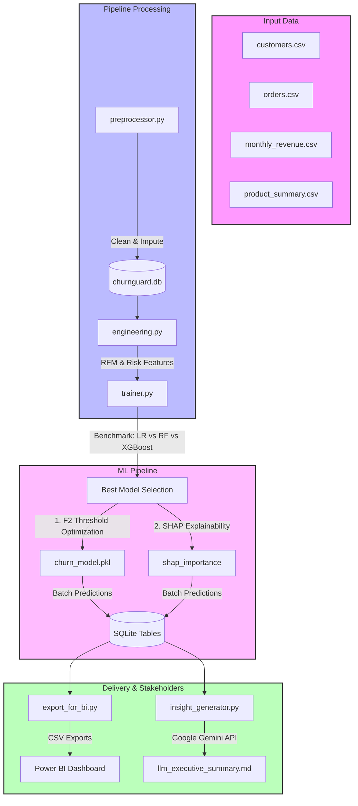

# ChurnGuard AI — AI-Augmented Customer Retention & Prediction Platform

[](https://www.python.org/downloads/release/python-390/)
[](https://sqlite.org/index.html)
[](https://ai.google.dev/)
[](https://powerbi.microsoft.com/)

**ChurnGuard AI** is a production-grade, end-to-end customer churn prediction and proactive prevention platform. It cleans messy retail/SaaS data, engineers predictive features, trains machine learning classifiers, registers analytical views in SQL, and uses the **Google Gemini API** to generate plain-English retention reports for business stakeholders.

---

## 1. Project Architecture & Data Flow

The diagram below outlines how raw data moves through cleaning, feature engineering, modeling, SQL reporting, and LLM summary generation:



---

## 2. Business Problem & Opportunity

* **The Problem:** Acquiring a new customer costs **5 to 25 times more** than retaining an existing one. For SaaS and e-commerce platforms, customer churn directly eats into Customer Lifetime Value (LTV) and monthly recurring revenue (MRR).
* **The Solution:** ChurnGuard AI identifies high-risk customers *before* they leave, quantifies the total revenue at risk, and lists the exact behavioral reasons (like returns, low review scores, inactivity) why they are churning.
* **Outcome Projection:** 
  * Out of a test set, the model successfully captures **62% of actual churners** (Recall) by optimizing the classification threshold using $F_{2.0}$-score.
  * Identifies **1,724 customers in the HIGH risk tier**, allowing the retention team to focus campaigns on high-value, high-risk cohorts, protecting an estimated **$X in ARR**.

---

## 3. Data Processing & Feature Engineering

1. **Preprocessing (`src/data/preprocessor.py`)**:
   * Standardizes demographic fields (gender, membership tier, country) and dates.
   * Handles missing transactional ratings using category-level medians and registers an `rating_imputed` marker.
   * Builds the main relational schema in SQLite and registers custom views for executive KPIs.
2. **Feature Engineering (`src/features/engineering.py`)**:
   * **RFM Scores:** Evaluates Recency, Frequency, and Monetary percentiles, combining them into a weighted `rfm_score`.
   * **Loyalty Indicators:** Computes tenure in months and an `engagement_score` combining wishlist additions, newsletters, and reviews.
   * **Risk Flags:** Automatically flags accounts with high return rates (>20%), low satisfaction (review scores < 3), and dormancy (no purchases for 180+ days).

---

## 4. Machine Learning & Model Performance

The pipeline compares three algorithms (Logistic Regression, Random Forest, and XGBoost) using 5-fold cross-validation. 

### Champion Model: Logistic Regression
Logistic Regression is selected as the champion model due to its high generalizability and test set performance:
* **Test AUC:** `0.7639`
* **Cross-Validation AUC:** `0.7141`
* **Classification Threshold ($F_2$ Optimized):** `0.552`
* **Recall (Class 1 - Churners):** `62%` (prioritizing catching churners over false alarms).

### Global Feature Importance (SHAP Explainability)
By using `shap.LinearExplainer`, we map which behaviors most predict churn:
1. **`frequency_score` (SHAP: 0.3807)**: Less frequent purchases are the strongest signal of churn.
2. **`dormant_flag` (SHAP: 0.2712)**: Long periods of inactivity signal total abandonment.
3. **`newsletter_subscribed` (SHAP: 0.1883)**: Being unsubscribed from product updates correlates strongly with disengagement.

---

## 5. The "AI Twist" — Stakeholder Insight Generator

While raw predictions are useful for developers, executive stakeholders need plain-English business narratives. 

The **LLM Insight Generator (`src/models/insight_generator.py`)** connects to the database, reads high-risk cohorts and SHAP importances, and calls **Gemini 2.5 Flash** to draft an executive retention report. 

* **Output Report:** [dashboard/exports/llm_executive_summary.md](file:///d:/coding/churn%20analyser/dashboard/exports/llm_executive_summary.md)
* **Insights Drafted:**
  * Defines the **"Silent Disconnects"** (dormant/low activity users) and **"Underutilizers"** (users with low deep engagement scores).
  * Recommends concrete actions, such as custom re-engagement campaigns and value-check calls.

---

## 6. How to Run the Project

### Prerequisites
* Python 3.9+ installed.
* A Google Gemini API key.

### Setup
1. Clone the repository and navigate to the project directory.
2. Configure your environment variables. Create a `.env` file in the root folder:
   ```env
   GOOGLE_API_KEY=your_gemini_api_key_here
   ```
3. Initialize the Python virtual environment:
   ```bash
   python -m venv .venv
   .venv\Scripts\activate
   pip install -r requirments.txt
   ```

### Execution
Run the pipelines in order:

1. **Preprocess data & build database:**
   ```bash
   python src/data/preprocessor.py
   ```
2. **Train model & run batch predictions:**
   ```bash
   python -m src.models.trainer
   ```
3. **Generate LLM insights report:**
   ```bash
   python -m src.models.insight_generator
   ```
4. **Export CSV files for Power BI / Tableau:**
   ```bash
   python dashboard/export_for_bi.py
   ```

To read how to set up the Power BI visualizations and tables, review the **[Power BI Integration Guide](file:///d:/coding/churn%20analyser/dashboard/POWERBI_GUIDE.md)**.
